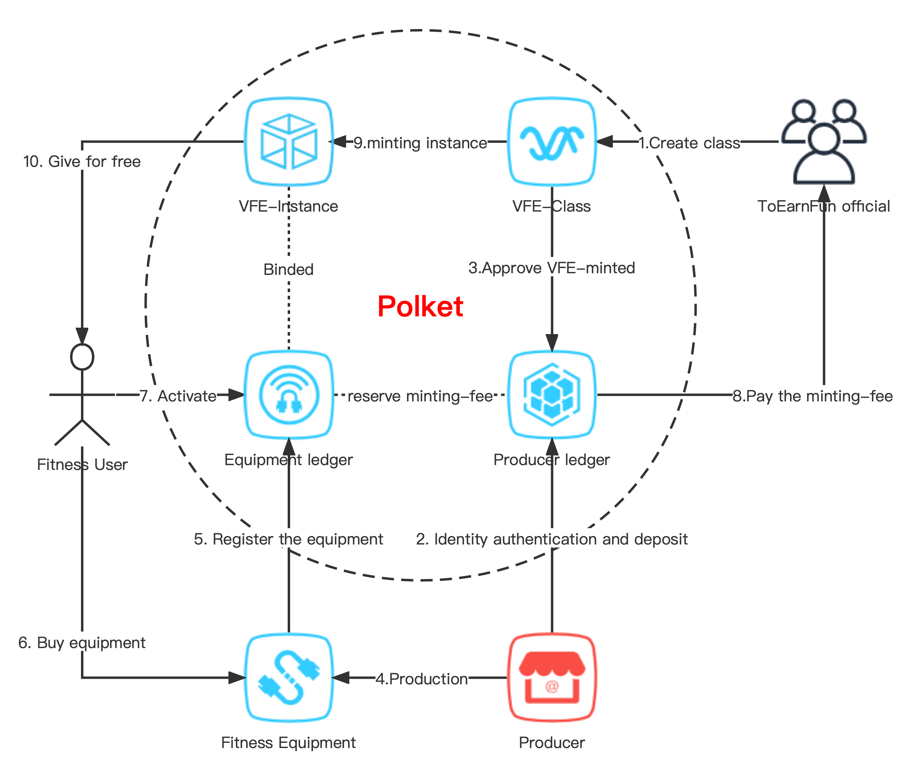
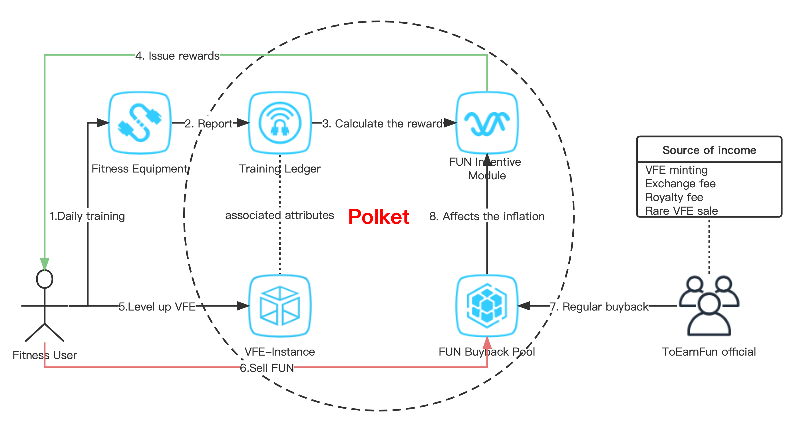
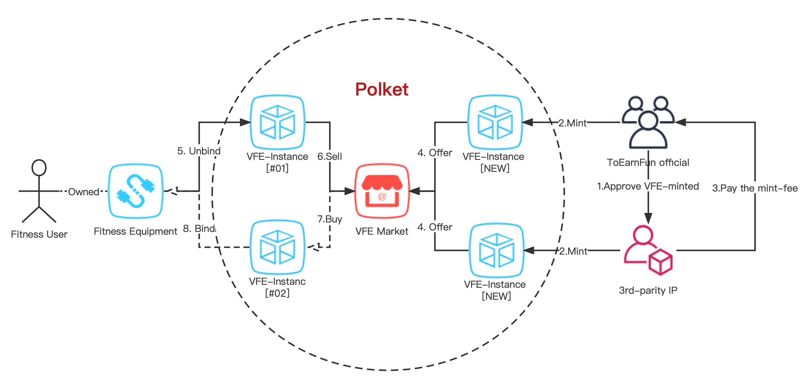
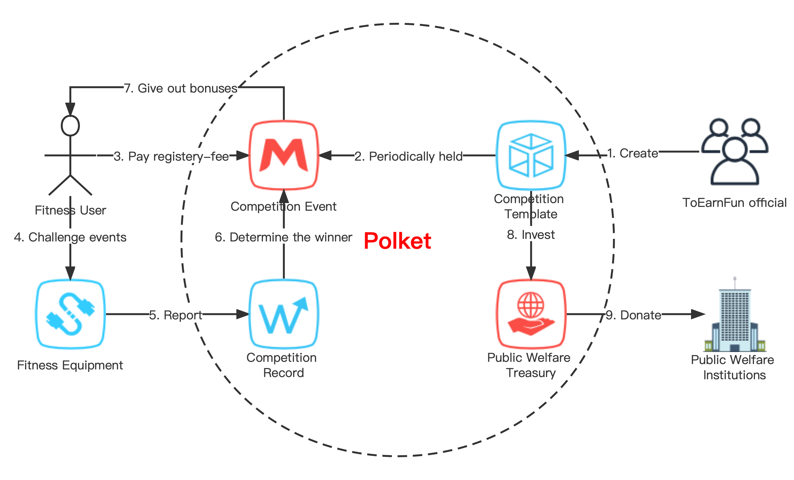
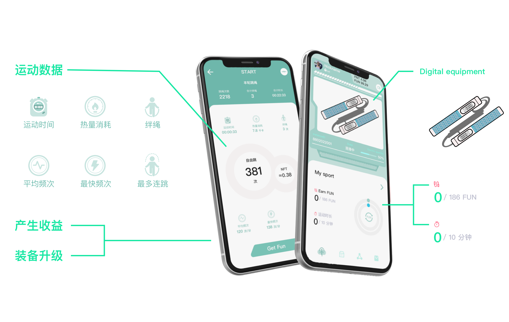

# ToEarnFun

## Where did the idea come from?

Inspired by the success of **STEPN**, we have great confidence in Web3 applications combined with life scenarios. Because to let the majority of users enter the Web3 world, the interactive way of life scenes is the easiest entry. So we started from the fitness field and developed a Web3 smart fitness application, allowing ordinary users to pick up fitness equipment, training daily + GameFi, and gradually understand how the Web3 world can bring them more value and fun.

Although **STEPN** achieved great success and dazzling attention as soon as it was launched, it also exposed the following problems:

1. **Getting started is difficult and high risk**. Beginners first need cryptocurrency and buy at least one virtual sneaker before they can start running. Due to the long-term price instability of cryptocurrencies, users cannot grasp the timing of buying cryptocurrencies, which can lead to serious losses.
1. **Insufficient decentralization**. **STEPN**, like most GameFi, adopts the solution of decentralization of asset transactions and centralized gameplay. This is because due to the bottleneck of the current smart contract technology, it is impossible to achieve complete decentralization, so the game system has the risk of self-theft, such as inflated rewards, malicious bans, and service suspension.
1. **Incentives are not sustainable**. The incentive tokens generated by **STEPN** running are freely circulated without restrictions, and the business model is unsustainable, and will eventually enter a death spiral.
1. **Is really cross-chain?**. Although **STEPN** publishes the same kind of assets on both public chains, the asset values are different, and it is not a cross-chain in the true sense.

After noticing the above problems, we finally adopted **Substrate** as the underlying technology in technology selection, and developed a blockchain named **Polket**. The goal of **Polket** is to create more commercial application scenarios for NFTs and connect to the Polkadot/Kusama network in a parachain manner. Based on the **Polket** chain, we will develop a smart fitness-type Web3 application to achieve capabilities that **STEPN** cannot achieve. We will name it **ToEarnFun**.

## What is ToEarnFun?

**ToEarnFun** is a **fit to earn** Web3 smart fitness application. Compared with other **x-to-earn** applications that only have **SocialFi** and **GameFi** elements, it can be connected with real smart fitness equipment. It relies on the encryption technology of the hardware chip to ensure that the sweat is paid fairly. The entry-level users of **ToEarnFun** do not need to purchase cryptocurrencies, but only need to purchase smart fitness equipment adapted to the application, and they can **fit to earn** immediately, greatly reducing the difficulty for ordinary users to enter the web3 world.

## Why ToEarnFun?

### Easy To Use

After the fitness equipment producer has passed the official qualification certification of **ToEarnFun**, the producer will register the chip public-key on the blockchain for each piece of fitness equipment produced. The user purchases **ToEarnFun** fitness equipment in the store, and completes the activation in the App, then can get a **VFE** (**Virtual Fitness Equipment**, it can be understood as a type of **NFT**). Users train through fitness equipment every day, and the system calculates the corresponding rewards based on the **VFE** attribute value on the chain.

Compared with **STEPN**, which requires users to use cryptocurrencies to purchase **Sneaker**, **ToEarnFun** does not require users to own cryptocurrencies, and it is easier to meet regional compliance requirements in terms of sales methods. The **ToEarnFun** community is formed by a group of users with real fitness needs, and is also a group that is optimistic about the future of Web3. Opens a door for Web2 users to enter the **Polkadot ecosystem**.

### Fitness + GameFi

**ToEarnFun** not only has the advantages of smart fitness applications, but also realizes the gameplay of **GameFi**. The core of the game is **VFE** as the gameplay, **VFE** has a level system, with four basic attributes (efficiency, skill, luck, durability), four rarities (common, elite, rare, epic), and available power. When the user activates the equipment, they will get a **VFE** of common rarity and level 0 for free. Users can earn **FUN** by consuming energy through daily train, **FUN** is a consumable in **VFE** gameplay, used to: upgrade **VFE** level, **VFE** charging, Synthesize **VFE**, transaction fees, challenge events and more. **VFE** Get attribute points for each level up, and users can configure attributes independently.

**Basic attribute description:**

- **Efficiency**: It affects the amount of **FUN** income. The higher the efficiency, the more stable the income growth. It is recommended for entry-level users to configure.
- **Skill**: Affects the training score factor. The higher the skill, the higher the **FUN** income from training score conversion. Training score can dramatically increase or decrease your income, so recommended configuration for advanced users.
- **Luck**: Affects the drop probability of items and the amount of income added by random numbers on the chain.
- **Durability**: Affects **VFE** charging cost.

**Rarity Description:**

- **Normal**: Free with purchase of fitness equipment.
- **Elite**: Collect **VFE** parts and combine with **VFE** chips to mint a new **VFE**, with a small probability to obtain.
- **Rare**: **ToEarnFun Official** regular sales.
- **Epic**: Participate in the **ToEarnFun official** event to get it.

Base stats and upgrade points, **common < elite < rare < epic**.

### Hardware-level Anti-cheating Technology

We require equipment producer to prevent cheating at the hardware level on fitness equipment. Through motion sensors and chip encryption technology, we can prevent the creation of false sports data and tamper with data through the App, so as to ensure that users' sweat is fairly rewarded.

### Completely Decentralized Implementation

Most **GameFi** applications are implemented with **asset transaction decentralization and game play centralized** solutions. Because most Dapps are implemented based on smart contracts, limited by the execution efficiency and upgrade difficulties of smart contracts, it is difficult to achieve decentralized gameplay. Thanks to the forkless upgrade feature of **Substrate**, we can implement the gameplay on the chain, and more new gameplay can be implemented through the **Runtime** upgrade in the future, which will be a Web3 application in the true sense.

### Sustainable Monetization

**FUN**, as a reward for users' fitness training, is not only used for the gameplay of **VFE**, but also has other monetization methods. **FUN** will not circulate freely, preventing peripheral speculation. **ToEarnFun official** will create a **FUN Buyback Pool**, and regularly use the **Treasury** assets to buyback the **FUN** that users put into the pool. Exactly what proportion of the treasury assets to use to buyback **FUN** is proposed by the community and voted by **FUN holders**.

### Flexible Fee Mode

Thanks to **Substrate**, the system can make the traning data submitted from the device without transaction fees, and you can choose different assets as transaction fees in the **VFE** gameplay.

### Community Driven Development

We adopt the same on-chain democratic governance module as **Polkadot**, continuously absorb community opinions, make the system develop more equitably, and allow **FUN holders** to gain more rights.

### Interoperability Of Cross-chains

The goal of **Polket** is to connect to **Polkadot/Kusama** as a parachain, so that **ToEarnFun** users can access other parachains of **Polkadot**. Through cross-chain interoperability, users can directly touch **DeFi**, **Staking**, **DEX** and other functions on the **ToEarnFun** application.

> Keyword note:
> - `VFE` is shorthand for `Virtual Fitness Equipment`. It can be understood as a subclass of `NFT (non-fungible token)`. We will create `VFE` such as `Smart Skipping Rope`, `Smart Hula Hoop`, `Smart Boxing`, `Spinning Bike` on the chain. What the user gets is a unique `VFE instance` minted by `VFE`.
> - `FUN` is a token issued by `ToEarnFun official` on the `Polket` chain to motivate users to training daily.

## What can ToEarnFun do?

### Promote the production and sales of fitness equipment

Participants: **Fitness Users**, **Equipment Producer**, **ToEarnFun Official**.

1. **ToEarnFun Official** first needs to create a **VFE** class on-chain. The first thing we implement is the **VFE** of the **rope skipping**.
1. To cooperate with **ToEarnFun**, equipment producers need to complete qualification certification and deposit a certain amount of security deposit into the **Producer Ledger** on the chain, which will be used to deduct fees for subsequent minting of **VFE** instances.
1. According to the deposit amount deposited by the equipment producer, the system grants the producer a certain number of **VFE** minting rights.
1. After the equipment producer completes the qualification certification, the **toearnfun-crypto-sdk** is integrated into the fitness equipment chip to realize the encryption protocol.
1. Before leaving the factory, fitness equipment needs to be registered on the **Equipment Ledger**, and a mintinng fee will be reserved from the **Producer Ledger** on-chain.
1. Fitness users can buy **ToEarnFun** cooperative fitness equipment in the local store without cryptocurrency.
1. Fitness users complete on-chain activation of fitness equipment through the **ToEarnFun** app.
1. After the fitness equipment is successfully activated, **Producer Ledger** will pay a minting fee from the reserved balance to **ToEarnFun Official Treasury**.
1. Because the producer has the minting right of the **VFE** class, a **VFE** instance will be minted on-chain to fitness users.
1. Fitness users can get a **VFE** instance for free, in fact, the producer paid the minting fee when registering the equipment on the chain.

This business model not only helps traditional fitness equipment producers enter the Web3 world, expands the user base, and promotes industrial development, but also brings stable income to **ToEarnFun** and motivates **FUN** on **GameFi** in the future. Modules provide the foundation.

### Fitness + GameFi

Participants: **Fitness Users**, **ToEarnFun Official**.

1. Fitness users use fitness equipment for daily training.
1. The fitness equipment signature training data will be reported to the on-chain **Training Ledger** through the App.
1. Calculate the reward according to the **VFE** attribute bound to the fitness equipment and the number of energy consumed during the training.
1. The **FUN** incentive module issues rewards to fitness users, but there is a daily upper limit on rewards.
1. Fitness users can use **FUN** to level up **VFE** instances to increase attribute points.
1. Fitness users can sell their excess **FUN** to the **FUN Buybck Pool**.
1. **ToEarnFun official** regularly buyback FUN in the pool.
1. After each buyback of **FUN**, its buyback price will change. In order to ensure price stability, changes in the **FUN Buyback Price** will affect its inflation rate.

This business model not only allows users who like fitness to get the equivalent of their sweat, but also allows users who are addicted to **GameFi** to have the goal of fitness.

### VFE Market

Participants: **Fitness Users**, **ToEarnFun Official**, **3rd-party IP**.

1. **ToEarnFun Official** can approve 3rd-party IP certain amount of **VFE** minting rights.
1. Whether it is **ToEarnFun Official** or **3rd-party IP**, as long as you have **VFE** minting rights, you can mint new **VFE** instances.
1. However, every time a **VFE** instance is minted by a 3rd-party IP, the minting fee needs to be paid to **ToEarnFun Official**.
1. The newly minted **VFE** instance will be put into the **VFE** market and will be sold by auction or fixed-price.
1. Fitness users can consume **FUN** to unbind the **VFE** instance on the equipment.
1. The unbound **VFE** instance can be sold to the **VFE** market.
1. Fitness users can also buy their favorite **VFE** instances in the **VFE** market.
1. Fitness users buy VFE instances with better attributes, and then bind them to the equipment for training, which is the most effective way to earn **FUN**.

Compared with traditional games, **GameFi** has the characteristics of playability and possession, and game items have value. **ToEarnFun Official** can bring income through the sale of **VFE**, or it can also approve 3rd-party IP to mint **VFE** to bring income. Fitness users can also freely exchange **VFE** in the market to achieve arbitrage.

### Competition Challenge

Participants: **Fitness Users**, **ToEarnFun Official**, **Public Welfare Organizations**.

1. **ToEarnFun Official** create competition template, set: registration fee, registration requirements, competition requirements, scoring rules, bonus distribution, cycle time limit, etc.
1. The competition template will publish event instances periodically.
1. Fitness users who meet the registration requirements can pay the registration fee to participate in the event.
1. Fitness users use their own fitness equipment to challenge according to the requirements of the competition.
1. The fitness equipment reports the training data to the on-chain competition record.
1. After the game, the game record will be determined according to the scoring rules of the game.
1. Prizes will be awarded to the winner of the competition.
1. A portion of the funds raised by the event will be invested in the **Public Welfare Treasury**.
1. The funds of the **Public Welfare Treasury** can be donated to public welfare organizations through the proposal of the Public Welfare Council.

The use of blockchain to realize competition events is a very suitable application scenario. It not only makes the competition fair, open and transparent, but also greatly reduces labor costs and allows the **Public Welfare Treasury** to obtain more funds. At the same time, **DAO** is used to manage the **Public Welfare Treasury**, which ensures the sustainable development of public welfare undertakings.

## Product highlight

## Maketing highlights 

| Item             | Traditional Smart Fitness | STEPN                 | ToEarnFun                     |
|------------------|---------------------------|-----------------------|-------------------------------|
| Real Product     | ⭕️                        | ❌                     | ⭕️                            |
| Daily Training   | ⭕️                        | ⭕️                    | ⭕️                            |
| GameFi           | ❌                         | ⭕️                    | ⭕️                            |
| Token Incentive  | ❌                         | ⭕️                    | ⭕️                            |
| Decentralization | ❌                         | ❓                     | ⭕️                            |
| Ecosystem        | In-App                    | Solana/BSC            | Polkadot                      |
| User             | Fitness enthusiast        | Blockchain enthusiast | Fitness&Blockchain enthusiast |
| Product Price    | Skipping Rope≈$29.99      | Sneaker≈$156          | Skipping Rope: Est. $69.99    |
| Income Source    | Equipment sales           | Sneaker sales         | VFE minting-fee & VFE sales   |

## Future planning

- 0️⃣Stage: Participate in the Polkadot Hackathon, 2022-06.
    - Write technical development documents.
    - Complete the product Demo to achieve**fit to earn**.
    - Looking for market operation partners and venture capitalist.
- 1️⃣Stage: Release the beta version, Est. **2022-Q2**.
    - Implement the production and sales scene of fitness equipment, and complete the production of the first batch of smart skipping rope equipment.
    - Implement the first category of **fitness training + GameFi scene** **skipping rope**, set up a **ToEarnFun skipping rope enthusiast community**, and invite users for internal testing.
    - Deploy the **POA** test network of **Polket** and release the **ToEarnFun App Beta**.
- 2️⃣Stage: Parachain auction, Est. **2022-Q3**.
    - **Polket** will participate in the **Kusama** parachain auction, and make public crowdloan plan.
    - Implement parachain system and release the main network.
    - Official launch of the first batch of ToEarnFun smart rope skipping equipment in **compliant regions**.
    - Implement FUN buyback pool module.
- 3️⃣Stage: VFE market, Est. **2022-Q4**.
    - Implement the **VFE Market** module and deploy to the main network.
    - Open **FUN Buyback Plan**.
    - Expand the sales area of ​​rope skipping equipment.
- 4️⃣Stage: Competition Challenge, Est. **2023-Q1**.
    - Implement the **Competition Challenge** module and deploy to the main network.
    - Establish a public welfare DAO and seek cooperation with non-profit organizations.
    - Implement XCMP to achieve cross-chain interoperability with other parachains.
- 🗓Future plans:
    - Official regular sales of rare VFEs.
    - Official will hold regular competition events.
    - Implement more **Smart Fitness Equipment** GameFi.
    - Implement the independent production of training plan courses in the form of subscription and payment.
    - Implement the mall module to establish more business cooperation.

## Team members

| Name                                         | Role                 | Introduction                                                                                                                                                                                                                          |
|----------------------------------------------|----------------------|---------------------------------------------------------------------------------------------------------------------------------------------------------------------------------------------------------------------------------------|
| [Mai zhiquan](https://github.com/zhiquan911) | Project Manager      | Engaged in the development of open source blockchain technology for many years, and created excellent frameworks such as [openwallet](https://github.com/blocktree/openwallet/). Currently fully devoted to the construction of Web3. |
| [Doxin Liang](https://github.com/metadex003) | Blockchain Developer | Excellent graduate of the Substrate advanced course, with 6 years of blockchain-related development experience.                                                                                                                       |
| [Arrom](https://github.com/shenzhen-arrom)   | Mobile Developer     | Participated in several hackathons organized by Polkadot and Ethereum.                                                                                                                                                                |
| [Fany](https://github.com/fanyinghao)        | Front-end developer  | Has many years of Dapp development experience.                                                                                                                                                                                        |
